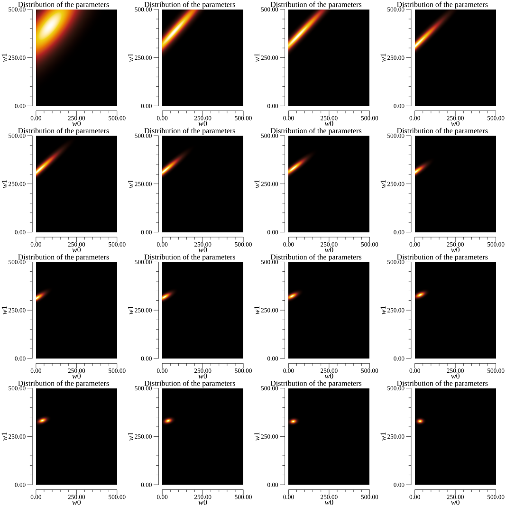
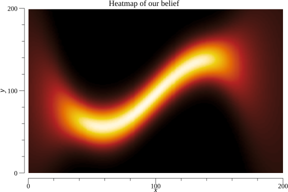
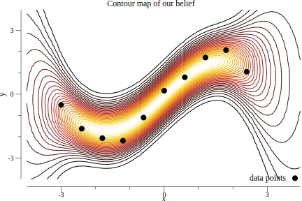

# Mini-projects in Machine Learning

The purpose of this project is to deepen my Machine Learning knowledge, and while implementing various ML algorithm I learn coding in Go. It is more fun than just calling a `scikit-learn` function in Python.

## Am I a horse - Pytorch CNN

This mini-project makes a convolutional neural network using Pytorch for binary classification whether the input image is a horse or a human. The training and validation datasets used are available here: https://laurencemoroney.com/datasets.html. We can even test the trained neural network to classify your photo and check whether you're rather a horse or human. I don't have access to CUDA enabled GPUs, hence the hyperparameters couldn't be fine-tuned to best classifying performance.

## Hopfield Network

Hopfield network is a kind of recurrent neural network that provides a model for understanding human memory. This network can be used for memory completion in order to restore missing parts of an image. The network is trained on a small set of data. The network defines an energy landscape where each datapoint forms a local minimum.

## K-Means Unsupervised Classifier

This algorithm finds clusters in the input data, thus grouping together data points by similarity. As a use case, we show how it's used to segment an image. Alternatively we can think of this algorithm which maps each datapoint to a lower dimensional representation just a label for each point.

<table>
<tr>
  <td></td>
  <td></td>
</tr>
  <tr>
    <td>Original image</td>
     <td>Segmented image in 15 colours</td>
  </tr>
 </table>

## Inferring Bernoulli Distribution

We keep tossing a biased coin and want to model our belief how much the coin is biased towards head. In the frequentist model the answer is the number heads divided by all tosses. We implemented the Bayesian model where given a prior belief we update the belief after each coin toss. In the below example we started with the loose belief the coin is fair and ended with the strong belief that the coin lands on head 20 percent of the time.

## Bayesian Linear Regression

In this regression problem we try to find the parameters  and  that generated the line . The below image shows how the belief is updated when we started to see more and more datapoints.

## Gaussian Processes

Gaussian processes are very useful to conceptualise belief in a non-parametric way. In this example we use the radial basis function (RBF) kernel.

We generated test data which is a sine curve with some noise. Samples from the fitted Gaussian Process are revealing the structure of generating curve.

Again we can visualise the distribution where we believe the function runs.

