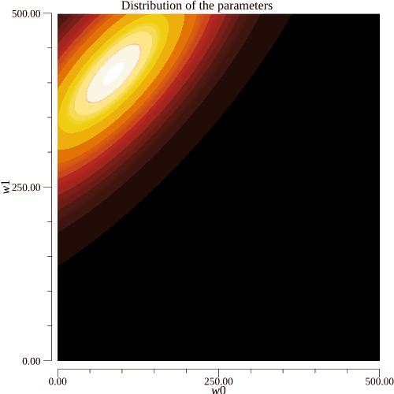
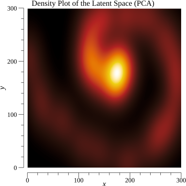
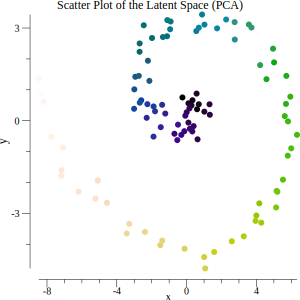
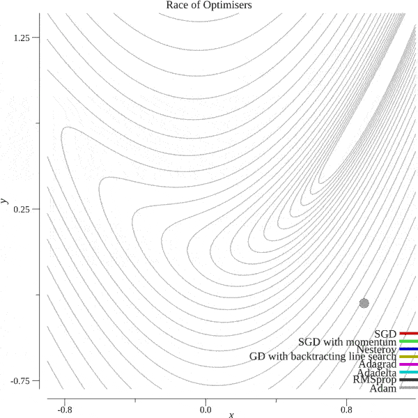
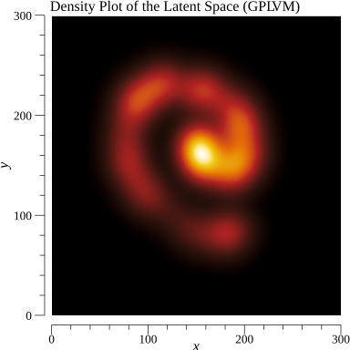
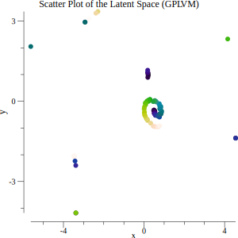
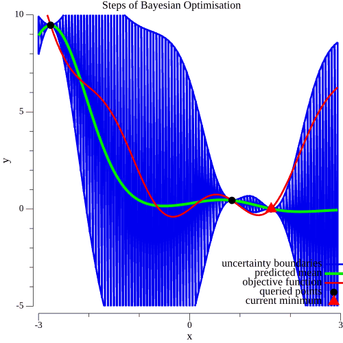

# Mini-projects in Machine Learning

The purpose of this project is to deepen my Machine Learning knowledge, and while implementing various ML algorithms, I learn coding in `Go`. It is more fun than just calling a `scikit-learn` function in Python.

## Contents

<!-- TOC depthFrom:1 depthTo:6 withLinks:1 updateOnSave:1 orderedList:0 -->

- [Mini-projects in Machine Learning](#mini-projects-in-machine-learning)
	- [Contents](#contents)
	- [Am I a horse - Pytorch CNN](#am-i-a-horse-pytorch-cnn)
	- [Hopfield Network](#hopfield-network)
	- [K-Means Unsupervised Classifier](#k-means-unsupervised-classifier)
	- [Inferring Bernoulli Distribution](#inferring-bernoulli-distribution)
	- [Bayesian Linear Regression](#bayesian-linear-regression)
	- [Gaussian Processes](#gaussian-processes)
	- [Principal Component Analysis](#principal-component-analysis)
	- [Optimisers](#optimisers)
	- [Gaussian Process Latent Variable Model](#gaussian-process-latent-variable-model)
	- [Bayesian Optimisation](#bayesian-optimisation)

<!-- /TOC -->

## Am I a horse - Pytorch CNN

This mini-project makes a convolutional neural network using Pytorch for binary classification whether the input image is a horse or a human. The training and validation datasets used are available here: https://laurencemoroney.com/datasets.html. We can even test the trained neural network to classify your photo and check whether you're rather a horse or human. I don't have access to CUDA enabled GPUs, hence the hyperparameters couldn't be fine-tuned to best classifying performance.

## Hopfield Network

Hopfield network is a kind of recurrent neural network that provides a model for understanding human memory. This network can be used for memory completion in order to restore missing parts of an image. The network is trained on a small set of data. The network defines an energy landscape where each datapoint forms a local minimum.

## K-Means Unsupervised Classifier

This algorithm finds clusters in the input data, thus grouping together data points by similarity. As a use case, we show how it's used to segment an image. Alternatively we can think of this algorithm which maps each datapoint to a lower dimensional representation just a label for each point.

<table>
<tr>
  <td></td>
  <td></td>
</tr>
<tr>
  <td>Original image</td>
  <td>Segmented image in 15 colours</td>
</tr>
</table>

## Inferring Bernoulli Distribution

We keep tossing a biased coin and want to model our belief how much the coin is biased towards head. In the frequentist model the answer is the number heads divided by all tosses. We implemented the Bayesian model where given a prior belief we update the belief after each coin toss. In the below example we started with the loose belief the coin is fair and ended with the strong belief that the coin lands on head 20 percent of the time.

## Bayesian Linear Regression

In this regression problem we try to find the parameters  and  that generated the line . The below image shows how the belief is updated when we started to see more and more datapoints.

## Gaussian Processes

Gaussian processes are very useful to conceptualise belief in a non-parametric way. In this example we use the radial basis function (RBF) kernel.

We generated test data which is a sine curve with some noise. Samples from the fitted Gaussian Process are revealing the structure of generating curve.

Again we can visualise the distribution where we believe the function runs.

<table>
<tr>
  <td></td>
  <td></td>
</tr>
</table>

## Principal Component Analysis

PCA is an unsupervised learning algorithm. As such, we would like to infer X and f from the equation Y=f(x). We could just say f is the identity, while Y=X. Rather, we reduce the dimensionality in order to arrive at a meaningful representation. We assume that the mapping is linear. As a presentation on how PCA works we embedded a spiral in a 10 dimensional space and applied PCA to reduce the dimensions down to 2. This resulted in the following density plot.

<table>
<tr>
  <td></td>
  <td></td>
</tr>
</table>

## Optimisers

In the following algorithms it might not be the case necessarily that we can integrate out all the random variables, ie. the integral is intractable. In these cases we usually optimize. There is a zoo of optimizer algorithms most are based on the principle of gradient descent. In the `Go` language there is an elegant way of defining an optimiser. We used "function closure". To test the algorithm we choose a 2D function. We chose a Rosenbrock style function. Under this function it is notoriously difficult to find the global minimum (this is the only local minimum). The minimum is at (1,1) in our chosen function. The animation below shows different optimisers trying to reach the minimum. The gradient descent with backtracking line search has two unfair advantages because it uses not only the gradient but the function itself too, and it has an inner loop where it chooses an optimal step size.

## Gaussian Process Latent Variable Model

This machine learning algorithm is the PCA on steroids. In contrast to PCA we use a GP prior. It can be thought of as a generalisation of PCA, using a linear kernel reduces GPLVM to PCA. We implemented GPLVM with RBF kernel. In a nutshell, we compute the marginal likelihood P(Y|X) and optimise it with respect to X. In the optimisation, we find the minimum of -log(P(Y|X)). We use the Adam optimiser implemented in the Optimisers section. To test the algorithm we generate a spiral and embed it in the 10d space in the same way we did with PCA. The resulting respective plots of the inferred spiral can be seen below.

<table>
<tr>
  <td></td>
  <td></td>
</tr>
</table>

## Bayesian Optimisation

As in regular gradient descent based optimisation our task is to find argmin(F(X)) where F is the objective function. This time we think of F as a black-box function, that is very difficult to compute, therefore we want to call it limited number of times. We need two ingredients for Bayesian optimisation: a *surrogate model* and an *acquisition function*. The surrogate model evaluates our belief about the function given the already queried points. We use a Gaussian process for this task. The acquisition function can be thought of as a strategy function which takes the current belief and returns the next location for querry. A good acquisition function balances well between *exploration* and *exploitation*.

<table>
<tr>
  <td></td>
</tr>
<tr>
  <td></td>
</tr>
</table>
